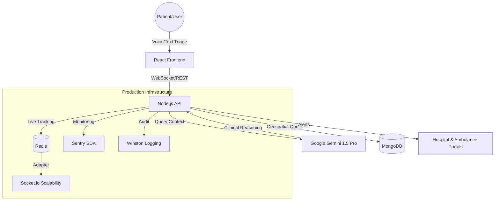

# RRIE — Rural Referral Intelligence Engine 🛰️🚑

> **Bridging the Great Divide: Orchestrating Life-Saving Referrals in Real-Time.**

RRIE is a mission-critical infrastructure designed to solve the "referral bottleneck" in rural healthcare. By combining **Generative AI Triage**, **Geospatial Intelligence**, and **Live Resource Orchestration**, RRIE ensures that every patient reaches the right facility, with the right specialists, at the right time.

---

## 🌟 The Vision
In rural areas, seconds save lives. Yet, 60% of emergency delays are caused by manual referral coordination and "blind" hospital transfers. RRIE eliminates the guesswork by creating a living, breathing digital twin of the healthcare network.

---

## 🚀 Key Features

### 1. User Emergency Portal (Multilingual Triage) 📱
- **Intelligent Voice Triage**: Speak symptoms naturally in **English or Hindi**. The system uses Google Gemini to translate, analyze, and reason through the clinical presentation.
- **AI Severity Grading**: Instantly classifies emergencies (e.g., Cardiac, Stroke, Trauma) and assigns a priority level.
- **Dynamic Resource Matching**: The engine doesn't just find the *closest* hospital; it finds the closest hospital that *actually has* the required specialists (Neurologists, Cardiologists) and equipment (CT Scans, MRI).
- **One-Tap Assistance**: Requests both a hospital referral and an automated ambulance dispatch simultaneously.

### 2. Hospital Command Center 🏥
- **Live Alert Feed**: Real-time notifications of incoming patients via WebSockets.
- **AI Medical Handover Report**: Generates a professional, structured clinical summary including:
    - Patient context and primary complaint.
    - AI-reasoned triage classification.
    - Risk flags (e.g., High Stroke Risk).
    - Clinical reasoning for the referral.
- **Official Documentation**: Includes a "Print Official Summary" feature with professional document styling for physical record-keeping.
- **Resource Management**: Hospitals can update their live state (Beds available, Specialists on-duty, Equipment status) to inform the global orchestration engine.

### 3. Ambulance Dispatch Portal 🚑
- **Real-Time Assignments**: Drivers receive instant push-notifications for new patient pick-ups.
- **Live Geospatial Tracking**: Integrated **Mapbox GL** for precise navigation to the patient's exact coordinates.
- **Communication Bridge**: Direct "Contact Patient" and "Contact Hospital" shortcuts to streamline field coordination.
- **Status Syncing**: Updates the entire network when the ambulance is dispatched, on-site, or en route to the hospital.

### 4. Network Explorer (Demonstration Mode) 🌐
- **Global Command View**: A premium Bento-style dashboard for judges and administrators to monitor the entire regional network at once.
- **Live WebSocket Sync**: Resource progress bars and status indicators update instantly as data changes anywhere in the system.
- **Health Indicators**: Aggregated metrics for total network capacity, active nodes, and systemic surge.
- **Logic Visualization**: Transparent view into how the RRIE Orchestration Engine ranks facilities based on geospatial and clinical data.

---

## 🏗️ System Architecture

RRIE is built on a high-availability, micro-orchestration architecture designed for low-latency emergency response.



---

## 🛡️ Production Readiness & Security

Beyond the core functionality, RRIE implements enterprise-grade patterns to ensure 99.9% uptime and data integrity.

### 1. Robust Scalability & Performance 🚀
- **Redis-Backed WebSockets**: Uses the `@socket.io/redis-adapter` for horizontal scaling, allowing the system to handle thousands of concurrent real-time connections across multiple server instances.
- **Geospatial Indexing**: Leverages MongoDB's **2dsphere** indexing and geospatial aggregation engines for O(1) proximity-based hospital discovery.
- **High-Speed Caching**: Redis handles live ambulance coordinates and system-wide rate limiting, reducing database load and ensuring sub-100ms response times for critical dispatching.

### 2. Monitoring & Reliability 📉
- **Error Tracking**: Integrated with **Sentry** (production mode) for real-time exception reporting, performance profiling, and distributed tracing.
- **Structured Logging**: **Winston** provides multi-transport logging (Console, `error.log`, `combined.log`) with colored output for development and JSON format for production ingestion.
- **Graceful Shutdown**: Implements custom handlers for `SIGTERM` and `SIGINT` to ensure all database connections, Redis clients, and WebSocket sessions are drained and closed cleanly before process exit.
- **Maintenance Awareness**: A specialized **Maintenance Overlay** in the frontend automatically triggers via specialized WebSocket events to inform users during planned system updates.

### 3. Comprehensive Security 🔒
- **Network Defense**: Utilizes **Helmet.js** to set security-focused HTTP headers, protecting against XSS, clickjacking, and other common vulnerabilities.
- **Granular Rate Limiting**: Redis-backed rate limiting (implemented via `express-rate-limit`) protects critical endpoints:
    - `authLimiter`: 5 attempts / 15 min for security.
    - `apiLimiter`: 30 requests / 1 min for general usage.
    - `strictLimiter`: 10 requests / 1 min for resource-intensive operations.
- **Secure Identity**: Built-in integration with **Firebase Admin SDK** for Google OAuth and staff verification.

### 4. Developer Experience & QA 🧪
- **Interactive Documentation**: Integrated **Swagger/OpenAPI** documentation (available via `/api-docs`) for standardized API contracts and testing.
- **Automated Testing**: Comprehensive API test suite using **Jest** and **Supertest**, featuring unstable mock modules for external dependencies like Firebase.
- **Containerization**: Full **Docker** support with a optimized multi-service `docker-compose.yml`, including **Health Checks** and automatic restart policies.

---

## 🛠️ Technology Stack

| Layer | Technology |
| :--- | :--- |
| **Frontend** | React 19, Vite, Tailwind CSS, Lucide Icons |
| **Backend** | Node.js, Express, Socket.io (Real-time updates) |
| **AI / ML** | Google Gemini 1.5 Pro (Clinical Triage & Language Translation) |
| **Database** | MongoDB & Mongoose |
| **Location** | Mapbox GL JS (Precision Geospatial Intelligence) |
| **Authentication**| Firebase Google OAuth (Secure staff portals) |

---

## 🚦 Getting Started

### Prerequisites
- Node.js (v18+)
- MongoDB Atlas or Local Instance
- Mapbox Access Token
- Google Gemini API Key
- Firebase Service Account

### Quick Start with Docker 🐳
For a production-mirror environment, use the included Docker setup:
```bash
docker-compose up --build
```
This will spin up:
- **Backend API** (Port 5000)
- **Frontend App** (Port 3000)
- **Redis Cache** (Port 6379)

### Manual Setup
1. **Clone & Install**
   ```bash
   git clone https://github.com/rishanksharma09/rrie.git
   cd rrie/backend && npm install
   cd ../frontend && npm install
   ```
2. **Environment Configuration**
   - Copy `.env.example` to `.env` in both `backend` and `frontend`.
3. **Run Services**
   - Backend: `npm run dev`
   - Frontend: `npm run dev`

---

## 🎯 Demonstration Guide for Judges

1. **Phase 1: The Emergency** — Open the `/user` portal. Toggle to **Hindi**, use the microphone to say: *"मेरे सीने में बहुत दर्द है और सांस लेने में दिक्कत हो रही है"* (I have severe chest pain and difficulty breathing).
2. **Phase 2: The Logic** — Watch the AI translate this, identify a Cardiac emergency, and suggest the nearest hospital with a Cardiologist and available ER bed based on geospatial data.
3. **Phase 3: The Handover** — Open the `/hospital` portal. See the live alert. Open the **Handover Report** and click **Print** to show the professional clinical summary.
4. **Phase 4: The Network** — Open the `/network` view to see the **Digital Twin** command center monitoring regional capacity.

---

## 📄 License
Built with ❤️ during the **Makeathon** for a better healthcare future.

---
*RRIE: Because every second counts.*
